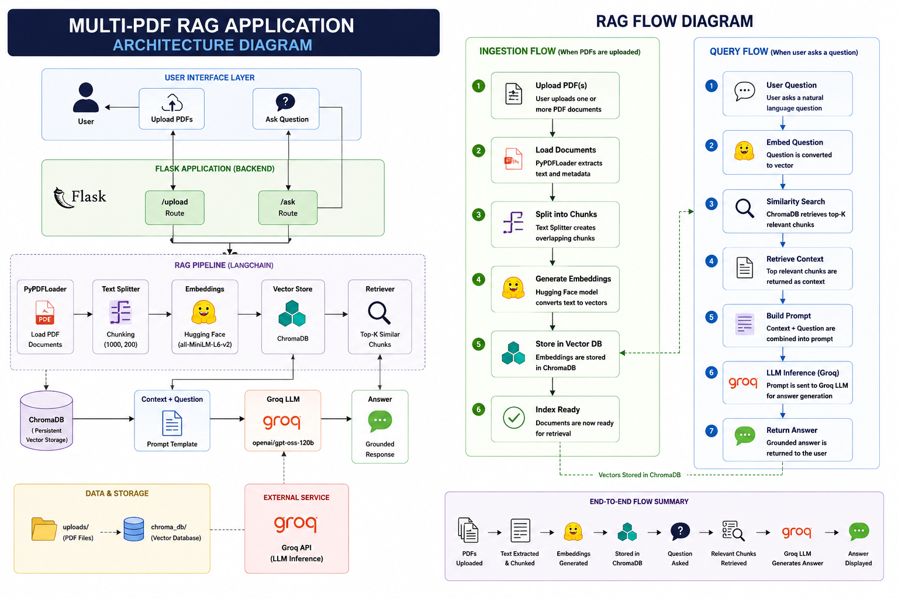

# Multi-PDF RAG Application

A production-oriented **Retrieval-Augmented Generation (RAG)** application that allows users to upload multiple PDF documents and ask natural-language questions about their content.

The application uses **LangChain** to orchestrate the RAG pipeline, **Hugging Face embeddings** for semantic representation, **ChromaDB** for vector storage and retrieval, **Groq** for LLM inference, and **Flask** for the web interface.

---

## Architecture



The architecture follows two main paths:

- **Ingestion path:** PDF Upload → PyPDFLoader → Text Chunking → Embeddings → ChromaDB
- **Question-answering path:** User Question → Retrieval → ChromaDB → Retrieved Context → LangChain RAG Chain → Groq LLM → Grounded Answer

---

## RAG Workflow

### 1. Document Ingestion

Users upload one or more PDF documents through the Flask web application.

### 2. Document Loading

`PyPDFLoader` extracts text and metadata from each PDF page.

### 3. Text Chunking

Large documents are divided into smaller overlapping chunks using LangChain's text splitter.

### 4. Embedding Generation

Each chunk is converted into a numerical vector using the Hugging Face `all-MiniLM-L6-v2` embedding model.

### 5. Vector Storage

The generated embeddings are stored in **ChromaDB**.

### 6. Retrieval

When a user asks a question, ChromaDB performs semantic similarity search and retrieves the most relevant document chunks.

### 7. Context Augmentation

The retrieved chunks are combined with the user's question to create the prompt sent to the LLM.

### 8. Generation

Groq provides LLM inference using:

`openai/gpt-oss-120b`

### 9. Grounded Response

The LLM generates an answer using the retrieved document context.

If the information is not available in the documents, the system is instructed to respond that it does not know.

---

## Tech Stack

| Technology | Purpose |
|---|---|
| Python | Core application |
| Flask | Web application |
| LangChain | RAG orchestration |
| PyPDFLoader | PDF document loading |
| Hugging Face | Text embeddings |
| Sentence Transformers | Embedding model |
| ChromaDB | Vector database |
| Groq | LLM inference |
| HTML/CSS | Frontend |
| Git | Version control |
| GitHub | Source code hosting |

---

## Features

- Upload multiple PDF documents
- Extract PDF text and metadata
- Automatic document chunking
- Semantic embeddings
- Vector similarity search
- Context-aware question answering
- Groq LLM integration
- Source document tracking
- Flask web interface
- Persistent ChromaDB vector storage
- Environment-based API key management

---

## Project Structure

```text
Multi-PDF-RAG/
│
├── app.py
├── rag.py
├── requirements.txt
├── .env.example
├── .gitignore
├── README.md
├── architecture.png
│
├── templates/
│   └── index.html
│
├── uploads/
│   └── .gitkeep
│
└── chroma_db/
    └── .gitkeep
```

> Note: Uploaded PDFs, `.env`, the virtual environment, and local ChromaDB data should not be committed to Git.

---

## Installation

### 1. Clone the repository

```bash
git clone https://github.com/Hridyanmohan/Multi-PDF-RAG.git
cd Multi-PDF-RAG
```

### 2. Create a virtual environment

Windows:

```bash
python -m venv venv
```

Activate it:

```bash
venv\Scripts\activate
```

### 3. Install dependencies

```bash
pip install -r requirements.txt
```

### 4. Configure environment variables

Create a `.env` file in the project root:

```env
GROQ_API_KEY=your_groq_api_key
```

Never commit `.env` to GitHub.

---

## Run the Application

Start the Flask application:

```bash
python app.py
```

Open the application in your browser:

```text
http://127.0.0.1:5000
```

---

## Example Questions

After uploading PDFs, users can ask questions such as:

- What is the main topic of the documents?
- What is ASHABot?
- What methodology was used in the study?

The system retrieves relevant document chunks before generating the answer.

---

## Example RAG Flow

```text
User Question
      |
      v
Question Embedding
      |
      v
Semantic Similarity Search
      |
      v
Top-K Relevant Chunks
      |
      v
Prompt + Retrieved Context
      |
      v
LangChain RAG Chain
      |
      v
Groq LLM
      |
      v
Grounded Answer
```

---

## Security

Sensitive configuration is kept outside the source code.

The following are excluded from Git:

```text
.env
venv/
chroma_db/
uploads/*.pdf
__pycache__/
```

API keys should never be committed to the repository.

---

## Current Limitations

- Local ChromaDB storage
- Flask development server
- No authentication
- No user-specific document collections
- No production cloud deployment yet

---

## Future Improvements

Planned production improvements include:

- Docker containerization
- GitHub Actions CI/CD
- AWS deployment
- Production WSGI server
- Cloud-based persistent vector storage
- Authentication and authorization
- Document management
- Conversation history
- Monitoring and logging
- Automated testing
- Health-check endpoints
- Rate limiting
- Production-grade file validation

---

## Deployment Roadmap

```text
Local Development
       |
       v
      Git
       |
       v
    GitHub
       |
       v
     Docker
       |
       v
 GitHub Actions
       |
       v
      AWS
       |
       v
Production RAG Application
```

---

## License

This project is intended for educational and portfolio purposes.
